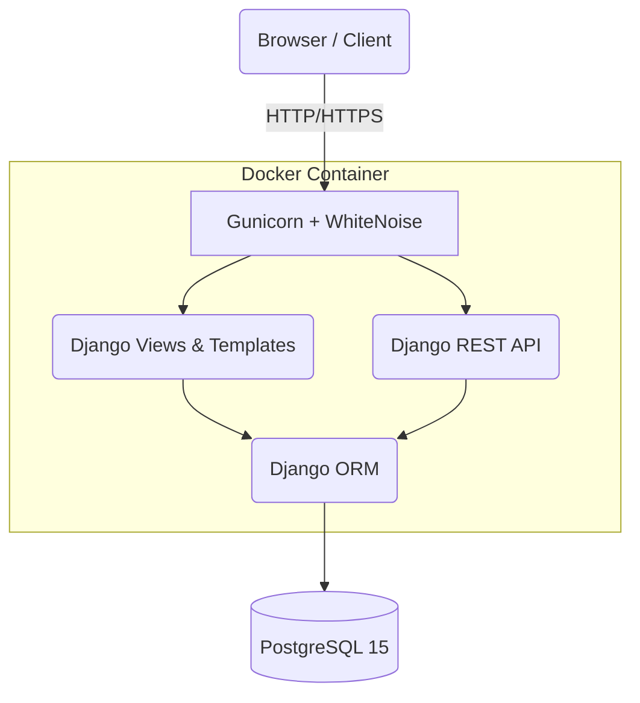

# CloudStudent

CloudStudent is a containerized university management platform built with Django, Django REST Framework, PostgreSQL, Docker, and GitHub Actions, with role-based access control, REST APIs, automated testing, observability, security hardening, and an Azure deployment blueprint.

## 1. Project Overview
CloudStudent enables university administrators, teachers, and students to seamlessly manage profiles, courses, enrollments, and academic performance through a secure, scalable web portal and a RESTful API.

## 2. Key Features
- **Role-Based Access Control (RBAC):** Distinct permissions for Admin, Teacher, and Student roles.
- **Academic Management:** Create and manage courses, enrollments, and academic records (marks & attendance).
- **RESTful API:** Token-authenticated API allowing full interaction with platform data.
- **Dockerized Environment:** Guaranteed local-to-production parity via `docker-compose`.
- **Automated CI/CD:** Continuous Integration pipelines via GitHub Actions.
- **Zero-Cost Azure Blueprint:** Fully documented Azure infrastructure templates without actual deployment overhead.

## 3. Technology Stack
| Technology | Purpose |
|------------|---------|
| Python 3.12 | Core Programming Language |
| Django 5.0.3 | Primary Web Framework |
| Django REST Framework | API Development |
| PostgreSQL 15 | Relational Database |
| Docker & Compose | Containerization & Orchestration |
| Gunicorn | WSGI Production Server |
| WhiteNoise | Static File Serving |
| GitHub Actions | CI/CD Pipeline |
| Pytest | Automated Testing Framework |
| Bootstrap 5 | UI/UX Framework |
| HTML/CSS/JavaScript | Frontend Rendering |

## 4. Architecture


*Note: A future Azure Deployment Blueprint is prepared (see section 13).*

## 5. Application Modules
- **`accounts`**: Manages custom User models, Roles, authentication views, and security logging signals.
- **`students`**: Handles Student Profile creation and tracking.
- **`courses`**: Manages Course creation, instructor assignment, and student Enrollments.
- **`academics`**: Records and computes student grades, marks, and attendance metrics.
- **`dashboard`**: Provides role-specific aggregate views (e.g. average marks, total students).
- **`api`**: Exposes REST endpoints securely via ViewSets and Serializers.

## 6. User Roles
Authorization is strictly enforced server-side for all roles:
- **ADMIN**: Complete unrestricted read/write access across all modules.
- **TEACHER**: Read/write access exclusively to Academic Records for courses they instruct. Can view course details and enrollments tied to their assigned classes.
- **STUDENT**: Read-only access exclusively to their own student profile, their active enrollments, and personal academic records.

## 7. Security
The platform employs strict security standards:
- **Authentication**: Token and session-based.
- **IDOR Protection**: Insecure Direct Object Reference vulnerabilities mitigated via strict queryset filtering.
- **Environment Boundaries**: `.env` driven settings, safe defaults.
For full details, read [SECURITY.md](SECURITY.md).

## 8. REST API
Fully functional endpoints available at `/api/`.
For request/response examples and authentication, read [API_DOCUMENTATION.md](API_DOCUMENTATION.md).

## 9. Observability
Request and security logging are baked in natively. Correlation IDs (`X-Request-ID`) trace requests end-to-end.
Read [OBSERVABILITY.md](OBSERVABILITY.md).

## 10. Docker
The platform runs inside isolated containers (`python:3.12-slim`).
Read [DOCKER.md](DOCKER.md).

## 11. CI/CD
GitHub actions continuously verifies Docker builds, runs migrations, and executes `pytest` tests on Ubuntu runners.
Read [CI.md](CI.md).

## 12. Testing
Test coverage spans views, APIs, permissions, IDOR boundaries, and model integrity.
Read [TESTING.md](TESTING.md) and [DEVELOPMENT.md](DEVELOPMENT.md).

## 13. Azure Deployment Blueprint
*Azure infrastructure is NOT currently provisioned to maintain a ₹0 budget.*
However, production-ready documentation and workflow templates are available in the [`azure/`](azure/) directory.

## 14. Project Structure
```text
cloudstudent/
├── accounts/          # Authentication & User Role logic
├── students/          # Student Profile management
├── courses/           # Course & Enrollment management
├── academics/         # Grades, Marks & Attendance
├── dashboard/         # Aggregated metrics views
├── api/               # REST Framework Serializers & ViewSets
├── cloudstudent/      # Core settings, WSGI, URLs
├── tests/             # Comprehensive Pytest suite
├── azure/             # Zero-cost Cloud deployment blueprint
├── static/            # Static assets
├── templates/         # HTML Bootstrap Templates
├── Dockerfile         # Production Container definition
├── docker-compose.yml # Orchestration configuration
├── requirements.txt   # Python Dependencies
└── manage.py          # Django entrypoint
```

## 15. Local Setup
Read [DEVELOPMENT.md](DEVELOPMENT.md) for full setup instructions.

## 16. Environment Variables
CloudStudent is configured primarily via the `.env` file (which is safely ignored by Git).
Read [DEVELOPMENT.md](DEVELOPMENT.md) for required variables.

## 17. Running the Application
```bash
docker compose up --build
```
Access at: `http://localhost:8000`

## 18. Running Tests
```bash
docker compose exec web python -m pytest
```

## 19. API Access
The API root is hosted at `/api/`.
Standard Token authentication is required. See [API_DOCUMENTATION.md](API_DOCUMENTATION.md).

## 20. Demo Credentials
*(For local development only. Do NOT use these in production.)*
- **Admin**: `admin` / `adminpassword123`
- **Teacher**: `teacher` / `teacherpassword123`
- **Student**: `student` / `studentpassword123`
*Run `python manage.py runscript seed_demo` to generate seed data if applicable.*

## 21. Development Workflow
Please adhere to the standard fork-and-pull workflow described in [CONTRIBUTING.md](CONTRIBUTING.md).

## 22. Cost Policy
This is a portfolio project with a strict **₹0 Out-of-Pocket Cost** requirement. No paid APIS, external managed databases, or active cloud resources are provisioned.

## 23. Known Limitations
- Caching layer (Redis/Memcached) omitted for zero-cost simplicity.
- Rate limiting omitted; rely on upstream WAF (e.g. Azure App Gateway).

## 24. Future Improvements
- Multi-tenant architecture for different colleges.
- Real-time attendance websocket notifications.

## 25. License
Currently, this repository does not include a `LICENSE` file. This means standard copyright rules apply by default. A license (such as MIT or GPL) should be evaluated and added in the future if open-source distribution is intended.
