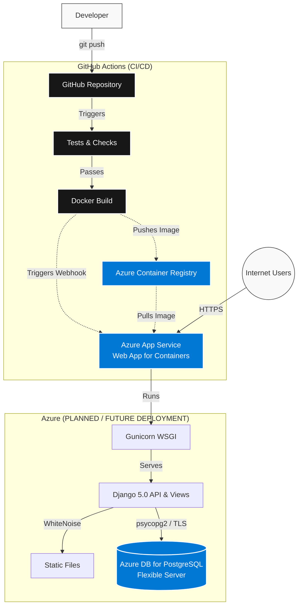

```mermaid
graph TD
    %% Developer and Source Control
    Dev[Developer] -->|git push| GH[GitHub Repository]
    
    %% CI/CD Pipeline
    subgraph "GitHub Actions (CI/CD)"
        GH -->|Triggers| CI_Tests[Tests & Checks]
        CI_Tests -->|Passes| CI_Build[Docker Build]
        CI_Build -.->|Pushes Image| ACR[Azure Container Registry]
        CI_Build -.->|Triggers Webhook| AppService
    end
    
    %% Azure Cloud Infrastructure (PLANNED / FUTURE DEPLOYMENT)
    subgraph "Azure (PLANNED / FUTURE DEPLOYMENT)"
        ACR -.->|Pulls Image| AppService[Azure App Service\nWeb App for Containers]
        
        AppService -->|Runs| Gunicorn[Gunicorn WSGI]
        Gunicorn -->|Serves| Django[Django 5.0 API & Views]
        Django -->|WhiteNoise| Static[Static Files]
        
        Django -->|psycopg2 / TLS| PG[(Azure DB for PostgreSQL\nFlexible Server)]
    end
    
    %% External Access
    Internet((Internet Users)) -->|HTTPS| AppService
    
    classDef azure fill:#0078D4,stroke:#fff,stroke-width:2px,color:#fff;
    classDef github fill:#181717,stroke:#fff,stroke-width:2px,color:#fff;
    classDef generic fill:#f9f9f9,stroke:#333,stroke-width:1px;
    
    class AppService,PG,ACR azure;
    class GH,CI_Tests,CI_Build github;
    class Dev,Internet generic;
```
